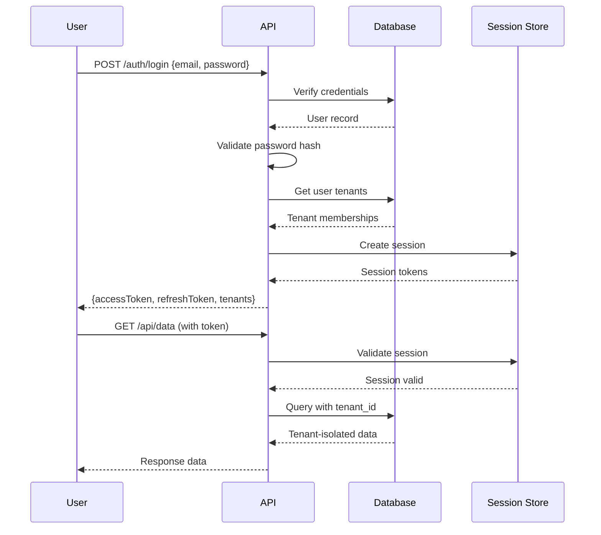
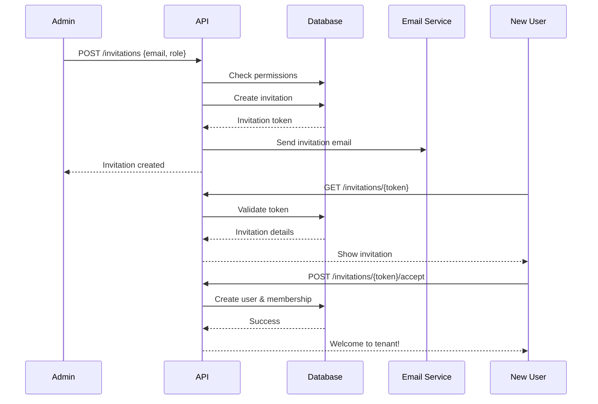

# Phase 2: Multi-Tenant Authentication System Implementation

## Overview

This document details the comprehensive multi-tenant authentication system implemented for the HubSpot-QuickBooks bridge application. The system provides secure user authentication, tenant isolation, role-based access control, and team collaboration features through an invitation system.

## Architecture Components

### 1. Database Schema

#### New Models Added

##### **User Model** (`users` table)
- **Purpose**: Core user authentication and profile management
- **Key Fields**:
  - Authentication: `email`, `passwordHash`, `emailVerified`
  - Profile: `firstName`, `lastName`, `avatarUrl`
  - Security: `failedLoginAttempts`, `lockedUntil`, `passwordResetToken`
  - Activity tracking: `lastLoginAt`, `lastActivityAt`, `loginCount`
  - Soft delete support: `deletedAt`
- **Security Features**:
  - Bcrypt password hashing
  - Email verification tokens
  - Password reset tokens with expiration
  - Account lockout after failed attempts

##### **Tenant Model** (`tenants` table)
- **Purpose**: Multi-tenant organization management
- **Key Fields**:
  - Identity: `name`, `slug` (unique URL identifier), `domain`
  - Business info: `industry`, `size`, `country`, `timezone`
  - Subscription: `subscriptionStatus`, `subscriptionPlan`, `trialEndsAt`
  - Configuration: `settings` (JSON), `maxUsers`
  - Soft delete support: `deletedAt`
- **Features**:
  - Trial period management
  - Custom domain support
  - Tenant-specific settings
  - User limits per plan

##### **TenantMembership Model** (`tenant_memberships` table)
- **Purpose**: User-tenant relationship and role management
- **Key Fields**:
  - Relationship: `userId`, `tenantId`, `role`
  - Preferences: `isPrimary` (default tenant)
  - Permissions: `permissions` (custom overrides)
  - Tracking: `joinedAt`, `lastAccessedAt`
- **Features**:
  - Role-based access control (OWNER, ADMIN, MEMBER, VIEWER)
  - Custom permission overrides
  - Primary tenant designation
  - Access tracking

##### **TenantInvitation Model** (`tenant_invitations` table)
- **Purpose**: Team invitation and onboarding system
- **Key Fields**:
  - Invitation: `email`, `invitationToken`, `role`
  - Status: `status` (PENDING, ACCEPTED, REJECTED, EXPIRED)
  - Lifecycle: `invitedAt`, `acceptedAt`, `expiresAt`
  - Context: `message`, `metadata`
- **Features**:
  - Secure token-based invitations
  - Automatic expiration
  - Duplicate prevention
  - Invitation history tracking

##### **UserSession Model** (`user_sessions` table)
- **Purpose**: JWT session management and device tracking
- **Key Fields**:
  - Authentication: `sessionToken`, `refreshToken`
  - Context: `userId`, `tenantId` (current tenant)
  - Device info: `ipAddress`, `userAgent`, `deviceInfo`
  - Lifecycle: `expiresAt`, `refreshExpiresAt`, `revokedAt`
- **Features**:
  - Stateless JWT with database backing
  - Refresh token rotation
  - Device fingerprinting
  - Session revocation

### 2. Database Relationships

```sql
Users (1) ──────────────> (*) TenantMemberships
                              │
                              ▼
Tenants (1) <───────────── (*) TenantMemberships

Users (1) ──────────────> (*) UserSessions

Users (1) ──────────────> (*) TenantInvitations (as sender)

Tenants (1) ────────────> (*) TenantInvitations

Tenants (1) ────────────> (*) InvoiceMapping (existing)
Tenants (1) ────────────> (*) PaymentMapping (existing)
Tenants (1) ────────────> (*) OAuthToken (existing)
```

### 3. Role-Based Access Control (RBAC)

#### Role Hierarchy

| Role | Permissions | Use Case |
|------|------------|----------|
| **OWNER** | Full control, delete tenant, manage billing | Tenant creator, company owner |
| **ADMIN** | Manage users, settings, integrations | Team administrators |
| **MEMBER** | Standard access to all features | Regular team members |
| **VIEWER** | Read-only access | Auditors, stakeholders |

#### Permission Matrix

| Action | OWNER | ADMIN | MEMBER | VIEWER |
|--------|-------|-------|---------|---------|
| View Data | ✅ | ✅ | ✅ | ✅ |
| Edit Data | ✅ | ✅ | ✅ | ❌ |
| Manage Users | ✅ | ✅ | ❌ | ❌ |
| Send Invitations | ✅ | ✅ | ❌ | ❌ |
| Manage Integrations | ✅ | ✅ | ❌ | ❌ |
| View Billing | ✅ | ❌ | ❌ | ❌ |
| Delete Tenant | ✅ | ❌ | ❌ | ❌ |

### 4. Security Features

#### Password Security
- Bcrypt hashing with configurable rounds (default: 10)
- Password complexity requirements
- Password reset tokens with expiration
- Password change history tracking

#### Session Management
- JWT tokens with short expiration (24 hours)
- Refresh tokens for extended sessions (30 days)
- Session revocation capability
- Device fingerprinting for security

#### Account Security
- Email verification requirement
- Account lockout after failed attempts
- Two-factor authentication ready (token fields)
- Soft delete for audit trails

#### Tenant Isolation
- All queries filtered by `tenant_id`
- Foreign key constraints ensure data integrity
- Row-level security through application logic
- No cross-tenant data leakage

## Implementation Details

### Migration Strategy

#### Phase 2A: Schema Creation (Current)
```sql
-- Create new tables without breaking existing functionality
CREATE TABLE users ...
CREATE TABLE tenants ...
CREATE TABLE tenant_memberships ...
CREATE TABLE tenant_invitations ...
CREATE TABLE user_sessions ...
```

#### Phase 2B: Data Migration (Future)
```sql
-- Migrate existing tenant_id values to new Tenant records
INSERT INTO tenants (id, name, slug, created_by_id)
SELECT DISTINCT 
  tenant_id,
  'Migrated Tenant ' || tenant_id,
  'tenant-' || tenant_id,
  (SELECT id FROM users WHERE is_super_admin = true LIMIT 1)
FROM invoice_mapping;

-- Add foreign key constraints
ALTER TABLE invoice_mapping 
  ADD CONSTRAINT fk_tenant 
  FOREIGN KEY (tenant_id) 
  REFERENCES tenants(id);
```

### Performance Optimizations

#### Indexes Created
```sql
-- User lookups
CREATE INDEX ON users(email);
CREATE INDEX ON users(is_active);
CREATE INDEX ON users(last_activity_at);

-- Tenant queries
CREATE UNIQUE INDEX ON tenants(slug);
CREATE INDEX ON tenants(is_active);

-- Membership queries
CREATE UNIQUE INDEX ON tenant_memberships(user_id, tenant_id);
CREATE INDEX ON tenant_memberships(tenant_id, role);
CREATE INDEX ON tenant_memberships(user_id, is_primary);

-- Session queries
CREATE UNIQUE INDEX ON user_sessions(session_token);
CREATE INDEX ON user_sessions(user_id);
CREATE INDEX ON user_sessions(expires_at);

-- Invitation queries
CREATE UNIQUE INDEX ON tenant_invitations(invitation_token);
CREATE INDEX ON tenant_invitations(email);
CREATE INDEX ON tenant_invitations(tenant_id, status);
```

#### Query Optimization Patterns

1. **Tenant Isolation**: Always filter by `tenant_id` first
```typescript
// Efficient
where: { tenant_id: tenantId, status: 'PAID' }

// Inefficient
where: { status: 'PAID', tenant_id: tenantId }
```

2. **Batch Operations**: Use transactions for related updates
```typescript
await prisma.$transaction([
  prisma.user.update(...),
  prisma.tenantMembership.create(...),
  prisma.userSession.create(...)
]);
```

3. **Selective Queries**: Only fetch needed fields
```typescript
select: {
  id: true,
  email: true,
  firstName: true,
  // Don't fetch passwordHash, tokens, etc.
}
```

## API Integration

### Authentication Flow



### Invitation Flow



## Usage Examples

### Creating a New Tenant with Owner

```typescript
const tenant = await prisma.tenant.create({
  data: {
    name: 'Acme Corporation',
    slug: 'acme-corp',
    timezone: 'America/New_York',
    createdById: userId,
    members: {
      create: {
        userId: userId,
        role: 'OWNER',
        isPrimary: true,
      }
    }
  }
});
```

### Checking User Permissions

```typescript
async function canEditInvoice(userId: string, tenantId: string, invoiceId: string) {
  const membership = await prisma.tenantMembership.findUnique({
    where: { userId_tenantId: { userId, tenantId } }
  });
  
  if (!membership) return false;
  
  const canEdit = ['OWNER', 'ADMIN', 'MEMBER'].includes(membership.role);
  
  if (!canEdit) return false;
  
  // Verify invoice belongs to tenant
  const invoice = await prisma.invoiceMapping.findFirst({
    where: { id: invoiceId, tenant_id: tenantId }
  });
  
  return !!invoice;
}
```

### Tenant-Isolated Queries

```typescript
// All queries automatically filtered by tenant
const invoices = await prisma.invoiceMapping.findMany({
  where: {
    tenant_id: currentTenantId,
    status: 'PAID',
    createdAt: { gte: startOfMonth }
  }
});
```

## Testing

### Unit Tests Required

1. **Authentication Tests**
   - Password hashing and verification
   - Token generation and validation
   - Session creation and expiration
   - Failed login attempt tracking

2. **Authorization Tests**
   - Role-based access control
   - Tenant isolation
   - Permission inheritance
   - Custom permission overrides

3. **Invitation Tests**
   - Token generation and validation
   - Expiration handling
   - Duplicate prevention
   - Accept/reject flows

### Integration Tests Required

1. **End-to-End Authentication**
   - Login → Session → API Access → Logout
   - Password reset flow
   - Email verification flow

2. **Multi-Tenant Scenarios**
   - User switching between tenants
   - Cross-tenant isolation verification
   - Concurrent tenant access

3. **Team Management**
   - Invitation → Accept → Access flow
   - Role changes and permission updates
   - Member removal and cleanup

## Deployment Checklist

### Pre-deployment

- [ ] Run migration on staging database
- [ ] Test rollback procedure
- [ ] Verify no breaking changes to existing APIs
- [ ] Load test new authentication endpoints
- [ ] Security audit of new endpoints

### Deployment

- [ ] Backup production database
- [ ] Run migration script
- [ ] Verify migration success
- [ ] Create initial admin user
- [ ] Test authentication flow

### Post-deployment

- [ ] Monitor error rates
- [ ] Check session creation metrics
- [ ] Verify tenant isolation
- [ ] Test invitation system
- [ ] Document any issues

## Rollback Procedure

If issues are encountered, execute the rollback script:

```bash
# Execute rollback
psql -U $DB_USER -d $DB_NAME -f prisma/migrations/phase2_auth_rollback.sql

# Verify data integrity
psql -U $DB_USER -d $DB_NAME -c "SELECT COUNT(*) FROM invoice_mapping;"
psql -U $DB_USER -d $DB_NAME -c "SELECT COUNT(*) FROM payment_mapping;"
```

## Future Enhancements

### Phase 2.5 (Planned)
- Two-factor authentication (TOTP/SMS)
- SSO integration (SAML/OAuth2)
- API key management per tenant
- Audit log for all actions

### Phase 3 (Planned)
- Multiple tenants per user
- Tenant switching UI
- Tenant hierarchies (parent/child)
- Cross-tenant data sharing permissions

## Support and Maintenance

### Monitoring Queries

```sql
-- Active users by tenant
SELECT t.name, COUNT(DISTINCT tm.user_id) as active_users
FROM tenants t
JOIN tenant_memberships tm ON t.id = tm.tenant_id
WHERE tm.last_accessed_at > NOW() - INTERVAL '30 days'
GROUP BY t.id;

-- Expiring trials
SELECT name, trial_ends_at
FROM tenants
WHERE is_trial = true 
  AND trial_ends_at BETWEEN NOW() AND NOW() + INTERVAL '7 days';

-- Failed login attempts
SELECT email, failed_login_attempts, locked_until
FROM users
WHERE failed_login_attempts > 0
ORDER BY failed_login_attempts DESC;
```

### Common Issues and Solutions

| Issue | Solution |
|-------|----------|
| User locked out | Reset `failed_login_attempts` and clear `locked_until` |
| Expired invitation | Generate new invitation or extend `expires_at` |
| Session expired | Use refresh token or re-authenticate |
| Wrong tenant context | Update `tenant_id` in user_sessions |
| Permission denied | Check `tenant_memberships.role` and `permissions` |

## Conclusion

The Phase 2 authentication system provides a robust, secure, and scalable foundation for multi-tenant operations. The implementation maintains backward compatibility while adding comprehensive user management, team collaboration, and security features necessary for production deployment.